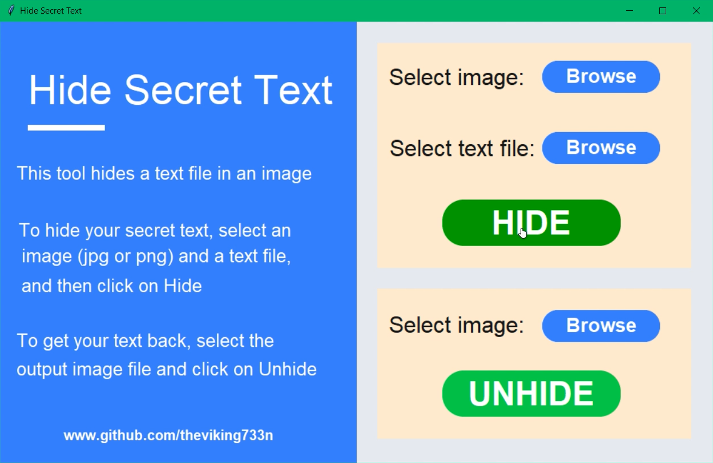

# Steganography
## _Best tool to hide text inside an image_

##### Have you ever thought of hiding a secret text? Using this python tool, you can hide text inside an image file.🔥🔥

## Features
- Easy to use 🙂
- Graphical User Interface 🔥
- Cross Platform 💻
- No technical knowledge required to use 😎




What is Steganography?

> Steganography is the practice of concealing a 
> message within another message or a physical object. 
> In computing/electronic contexts, a computer file, 
> message, image, or video is concealed within another 
> file, message, image, or video.


## Dependencies
- [tkinter](https://docs.python.org/3/library/tkinter.html)
- [CustomTkinter](https://github.com/TomSchimansky/CustomTkinter)
- [Pillow](https://pypi.org/project/Pillow/)


## Installation
```sh
pip install customtkinter
```
```sh
pip install Pillow
```

## Usage
```sh
python3 gui.py
```
